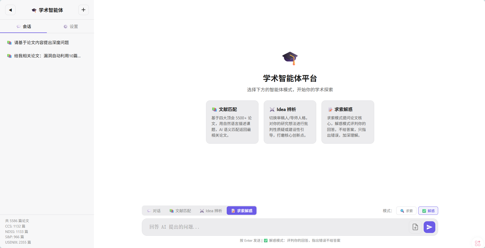
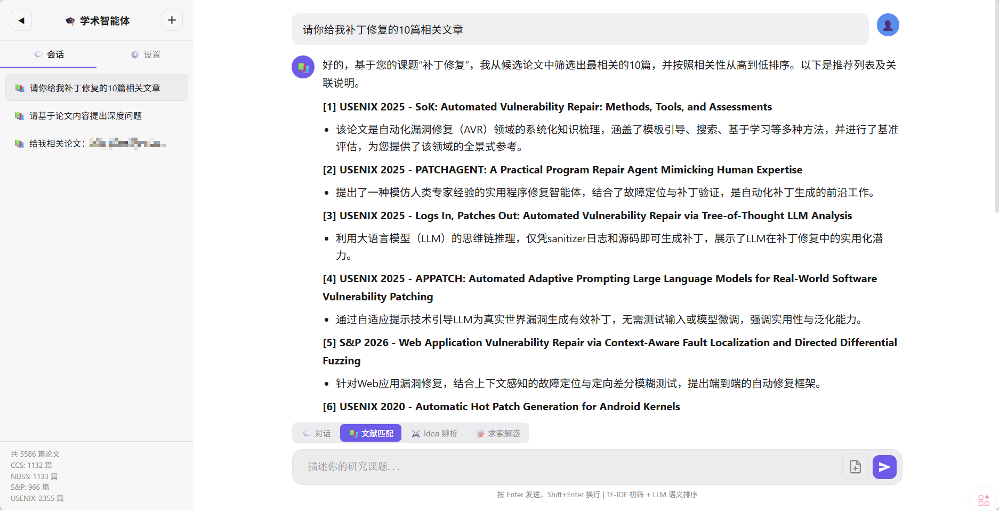
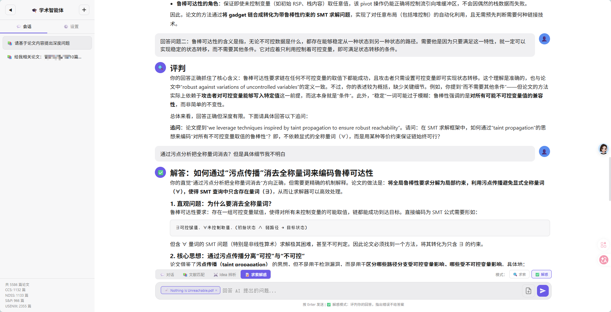

# 🎓 4TH Cyber Security Conference

网络安全四大顶会（NDSS、USENIX Security、IEEE S&P、CCS）论文爬虫与学术智能体平台。







## 功能概览

### 📚 论文爬虫

自动获取四大顶会 2018-2026 年的论文信息（标题、摘要、PDF 链接、Slides 链接）。

| 会议 | 覆盖年份 | 数据量 |
|------|---------|--------|
| NDSS | 2018-2026 | ~1100 篇 |
| USENIX Security | 2018-2026 | ~2300 篇 |
| IEEE S&P | 2023-2026 | ~960 篇 |
| CCS | 2019-2025 | ~1100 篇 |

> S&P 2018-2022、CCS 2018/2026 待追加。

### 🤖 学术智能体平台

基于爬取的论文数据构建的 Web 智能体平台，支持多智能体切换：

| 智能体 | 模式 | 功能 |
|--------|------|------|
| **📚 文献匹配** | — | 自然语言描述课题，多关键词扩展语义匹配，返回最相关论文 |
| **⚔️ Idea 辨析** | 审稿人 🔍 | 严厉质疑研究假设、边界、贡献、增量、验证 |
| | 导师 🎓 | 引导凝练科学问题，打磨创新点，务实落地 |
| **📝 求索解惑** | 求索 🔍 | 提问论文核心问题，评判回答时**只指出错误，不给答案** |
| | 解惑 ✅ | 提问论文核心问题，评判回答时**指出错误并给出正确答案** |
| **📄 PDF 解读** | — | 上传 PDF 后引用，AI 解析内容进行对话 |


## 快速开始

### 1. 环境准备

```bash
git clone https://github.com/HackC0der/CyberAcademicAssistant.git
cd CyberAcademicAssistant

# 使用 uv 管理依赖（推荐）
uv sync                   # 安装爬虫依赖
uv sync --extra agent     # 安装爬虫 + 智能体依赖
```

### 2. 配置 LLM

启动后在左侧栏「⚙️ 设置」中填写：

| 参数 | 说明 |
|------|------|
| API Base URL | LLM 接口地址（如 `https://api.openai.com/v1`） |
| API Key | 你的 API 密钥 |
| Model | 模型名称（如 `gpt-4o-mini`） |
| Temperature | 生成温度（0-2） |
| Max Tokens | 最大输出长度（0=不限制） |

配置保存在 `agent/config.json`，支持任何 OpenAI 兼容接口。

### 3. 爬取论文数据（可选）

```bash
uv run bash crawl_all.sh           # 一键爬取所有会议
uv run bash crawl_all.sh ndss ccs  # 仅爬取指定会议
```

### 4. 启动智能体平台

```bash
cd agent
uv run python app.py
```

浏览器访问 http://localhost:5000

## 项目结构

```
4TH-CyberSecurityConference/
├── crawlers/                   # 论文爬虫脚本
│   ├── ndss_crawler.py
│   ├── usenix_crawler.py
│   ├── sp_crawler.py
│   └── ccs_crawler.py
├── agent/                      # 学术智能体平台
│   ├── app.py                  # Flask 入口（会话API + PDF上传 + 路由注册）
│   ├── agents/                 # 智能体模块（可插拔）
│   │   ├── __init__.py         # 自动发现与注册
│   │   ├── base.py             # Agent 基类
│   │   ├── literature.py       # 文献匹配（多关键词扩展搜索）
│   │   ├── debate.py           # Idea 辨析（审稿人 + 导师）
│   │   └── quiz.py             # 求索解惑（求索 + 解惑）
│   ├── llm_client.py           # LLM API 封装
│   ├── paper_store.py          # TF-IDF 论文索引与检索
│   ├── pdf_utils.py            # PDF 解析（带磁盘缓存）
│   ├── config.json             # LLM 配置（git 忽略）
│   ├── data/                   # 运行时数据（git 忽略）
│   │   ├── sessions.json       # 会话持久化
│   │   └── pdf_cache/          # PDF 解析缓存
│   ├── static/
│   │   ├── style.css
│   │   └── app.js
│   └── templates/
│       └── index.html
├── pyproject.toml              # uv 项目配置
├── crawl_all.sh
├── NDSS/                       # 论文数据（git 忽略）
├── USENIX/
├── S&P/
└── CCS/
```

## 使用指南

### 文献匹配

1. 选择 📚 文献匹配 模式
2. 用自然语言描述研究课题
3. AI 通过多关键词扩展搜索（直接词 + 同义词 + 广义词）返回最相关论文

### Idea 辨析

1. 选择 ⚔️ Idea 辨析 模式
2. 切换审稿人 🔍 或导师 🎓（共享上下文，随时切换）
3. 描述研究想法，获得批判性质疑或建设性引导

### 求索解惑

1. 选择 📝 求索解惑 模式（**必须上传并引用论文 PDF**）
2. **求索** 🔍：AI 提出 3-5 个深度问题，评判回答时只指出错误，不给答案
3. **解惑** ✅：AI 提出 3-5 个深度问题，评判回答时指出错误并给出正确答案
4. 求索与解惑共享上下文，随时切换

### PDF 解读

1. 点击输入框 📎 按钮上传 PDF（支持多个）
2. PDF 以聊天气泡显示，点击「引用论文」按钮添加到输入框
3. 引用标签持久化保存，重启后自动恢复
4. 无文本输入时直接发送，AI 自动分析 PDF 内容
5. PDF 解析结果带磁盘缓存，重复上传秒加载

### 模型设置

点击左侧栏「⚙️ 设置」调节参数，「🌙/☀️」切换暗色/亮色主题。

## 扩展智能体

在 `agent/agents/` 下创建新文件即可，无需修改其他代码：

```python
from .base import BaseAgent

class MyAgent(BaseAgent):
    name = "my_agent"
    route = "/api/my-agent"

    def build_messages(self, data: dict) -> list:
        return [
            {"role": "system", "content": "你是..."},
            {"role": "user", "content": data.get("message", "")},
        ]
```

重启服务自动注册。前端需在 `app.js` 的 `switchMode` 和 HTML 的 `agent-tabs` 中添加新模式。

## 许可证

MIT License
